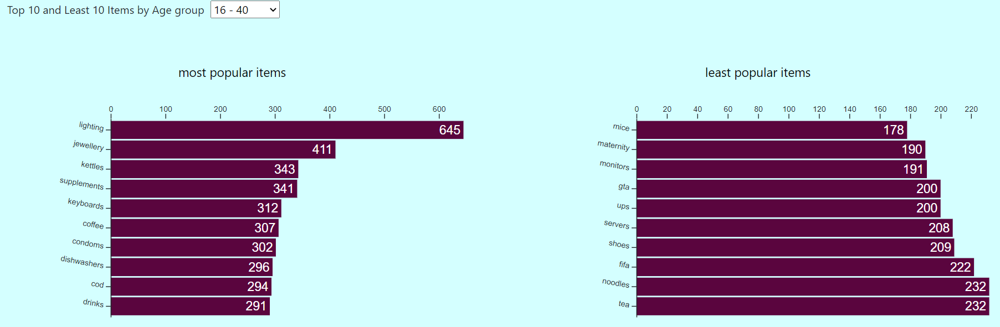

# E-Commerce Project
A JavaScript project using D3 library to visualise data from an e-commerce store dataset. The data visualised showed the following:
* Most popular items annually, monthly and weekly
* Most popular and least popular items among different age groups
* Most popular and least popular items based on the country of buyers
* Most popular items during the festive period (christmas)
* Most popular and least popular items for males and females
* Total sales annually and quarterly
* Most popular and least popular item for each item category
* Demographic information by age, gender and country of customers

This project was designed using the D3 JavaScript library.

Screenshots of the visualizations are shown below:

* Demographics

* Popular Items Annually, Monthly and Weekly

* Popular Items by Age Group

* Popular Items by Country

How To Use:
1. Install a server on the system (WAMP/LAMP/MAMP)
2. Ensure that the server is running correctly
3. Download this project as a zip file from GitHub
4. Extract the downloaded zip file into a specified folder with name <folder_name>
5. Copy the extracted folder to the server root directory (i.e the 'www' folder in the case of WAMP)
6. Open the browser and enter 'localhost/<folder_name>' where <folder_name> is the name of the extracted folder

The link to the D3 library can be found [here](https://d3js.org/)